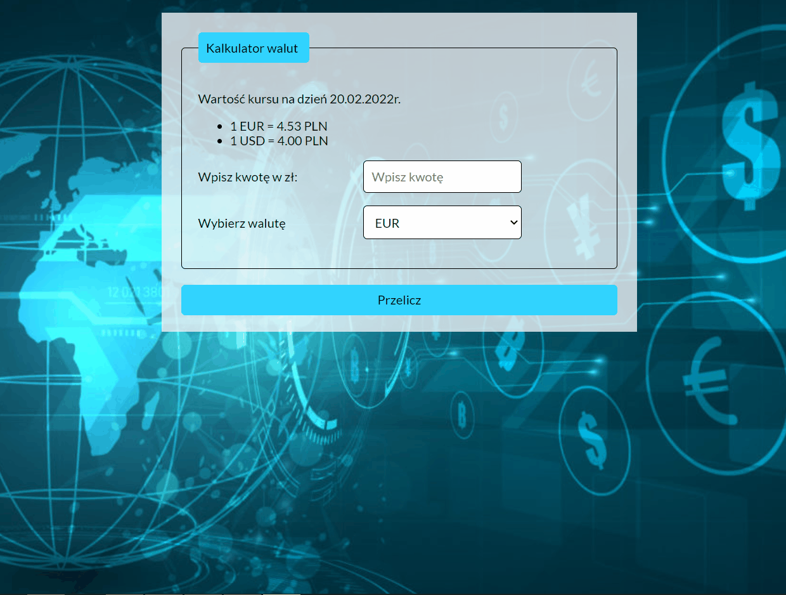

# Currency converter

## Description

This webpage was created as a part of [YouCode](https://youcode.pl) course. It's a simple online currency converter, where you can enter amount of PLN and calculate it to the selected currency.

## Used technologies:

- Semantic HTML;
- CSS;
- BEM;
- ES6 features.

## Demo version:

https://lenanag.github.io/currency_converter/
